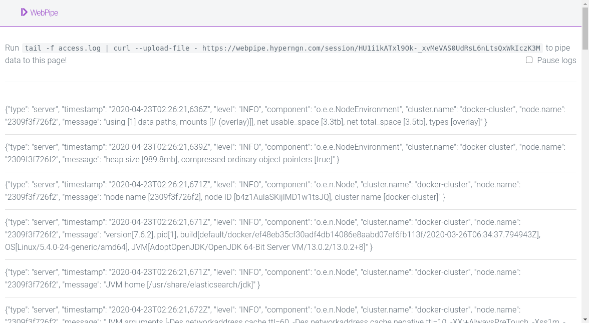

# WebPipe

WebPipe allows you to pipe from your servers to the browser!

## Screenshots



## Usage

Easiest way to get webpipe working is by using the [pre-built docker image on
dockerhub](https://hub.docker.com/r/hyperngn/webpipe)

```
docker run --rm --publish 8000:8000 hyperngn/webpipe
```

This spins up a new container with webpipe running on http://localhost:8000

You can also spin it up by running the following command if you have a working
version of Elixir:

```
iex -S mix
```

If you don't have Elixir you can build a docker container and run it in a
container via the following commands:

```
# build the image
docker build -t webpipe:latest .
# run the image
docker run --publish 8000:8000 webpipe:latest
```
